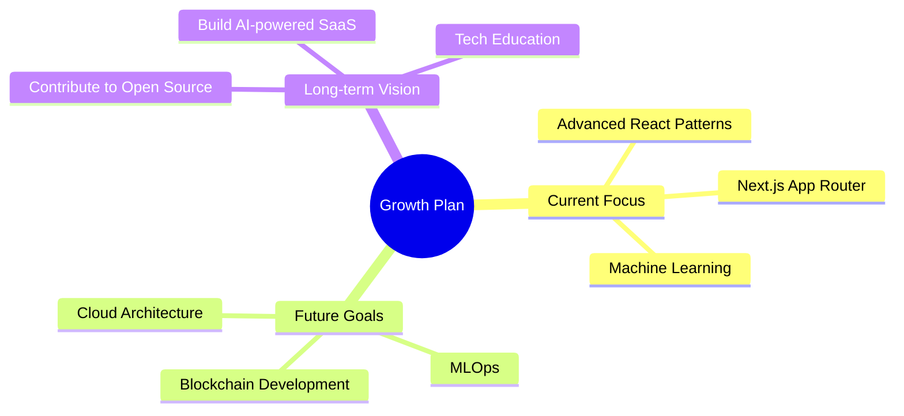

# <div align="center">

<div style="background: linear-gradient(90deg, #6366F1 0%, #A78BFA 50%, #EC4899 100%); padding: 40px; border-radius: 15px;">
  
</div>

<div align="center">
  
</div>

<div align="center">
  <a href="https://sushanshetty.vercel.app" target="_blank">
    
  </a>
  <a href="https://linkedin.com/in/sushanshetty1" target="_blank">
    
  </a>
  <a href="https://github.com/sushanshetty1" target="_blank">
    
  </a>
  <a href="mailto:sushanshetty1470@gmail.com">
    
  </a>
</div>

##  About Me


```javascript
const sushanShetty = {
  location: "India",
  currentFocus: "Full-Stack Development & AI/ML",
  passions: [
    "Building Interactive Web Apps", 
    "Machine Learning Models", 
    "Data Science"
  ],
  strengths: ["Problem Solving", "Creative Coding", "Fast Learning"],
  interests: ["DevOps", "Blockchain", "Neural Networks"],
  funFact: "I debug code in my dreams and wake up with solutions ☕"
};
```

> *"Crafting digital experiences today, exploring new technologies tomorrow. I transform ideas into elegant code and create solutions that make a difference. My journey in tech is fueled by curiosity and a commitment to building a more connected digital world."*

<div align="center">
  <a href="https://sushanshetty.vercel.app">
    
  </a>
</div>

## 🛠️ Tech Arsenal

<table align="center">
<tr>
<td valign="top">

### 💻 Programming 


</td>
<td valign="top">

### 🌐 Frontend


</td>
</tr>
<tr>
<td valign="top">

### 🔧 Backend & DB


</td>
<td valign="top">

### 🧠 AI & ML


</td>
</tr>
<tr>
<td valign="top" colspan="2">

### 🔄 Tools & DevOps


</td>
</tr>
</table>

## 📊 GitHub Stats

<div align="center">
  
</div>

<div align="center">
  
  
</div>

<p align="center">
  
</p>

## 🏆 Featured Projects

<table align="center">
  <tr>
    <td width="50%">
      <h3 align="center">🛍️ E-Commerce Platform</h3>
      <p align="center">
        <a href="https://github.com/sushanshetty1" target="_blank">
          
        </a>
        <span>
          
          
          
        </span>
        <p><strong>Full-featured e-commerce platform with secure payment processing, product management, and responsive design</strong></p>
      </p>
    </td>
    <td width="50%">
      <h3 align="center">🧠 AI Image Generator</h3>
      <p align="center">
        <a href="https://github.com/sushanshetty1" target="_blank">
          
        </a>
        <span>
          
          
          
        </span>
        <p><strong>Text-to-image generation using deep learning models with customizable styles and advanced parameters</strong></p>
      </p>
    </td>
  </tr>
  <tr>
    <td width="50%">
      <h3 align="center">✅ Task Management App</h3>
      <p align="center">
        <a href="https://github.com/sushanshetty1" target="_blank">
          
        </a>
        <span>
          
          
          
        </span>
        <p><strong>Collaborative task management with real-time updates, role-based permissions, and custom dashboards</strong></p>
      </p>
    </td>
    <td width="50%">
      <h3 align="center">📊 Social Media Dashboard</h3>
      <p align="center">
        <a href="https://github.com/sushanshetty1" target="_blank">
          
        </a>
        <span>
          
          
          
        </span>
        <p><strong>Analytics dashboard for social media with customizable widgets and insightful data visualizations</strong></p>
      </p>
    </td>
  </tr>
</table>

## 🚀 Learning Path
  
<div align="center">
  


</div>

<div align="center">
  <div style="background: linear-gradient(90deg, #6366F1 0%, #A78BFA 50%, #EC4899 100%); margin-top: 50px; padding: 30px; border-radius: 20px;">
    
    
    

    <div style="display: flex; justify-content: center; gap: 20px; margin-top: 20px;">
      <a href="https://sushanshetty.vercel.app">
        
      </a>
      <a href="https://linkedin.com/in/sushanshetty1">
        
      </a>
      <a href="mailto:sushanshetty1470@gmail.com">
        
      </a>
    </div>
  </div>
</div>
