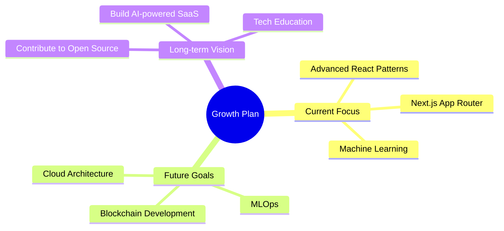

<div align="center">

# SUSHAN SHETTY

[](https://sushans.dev)
[](https://linkedin.com/in/sushanshetty1)
[](https://github.com/sushanshetty1)
[](mailto:sushanshetty1470@gmail.com)

</div>

##  About Me

```javascript
const sushanShetty = {
  location: "India",
  currentFocus: "Full-Stack Development & AI/ML",
  passions: [
    "Building Interactive Web Apps", 
    "Machine Learning Models", 
    "Data Science"
  ],
  strengths: ["Problem Solving", "Creative Coding", "Fast Learning"],
  interests: ["DevOps", "Blockchain", "Neural Networks"],
  funFact: "I debug code in my dreams and wake up with solutions ☕"
};
```

> *"Crafting digital experiences today, exploring new technologies tomorrow. I transform ideas into elegant code and create solutions that make a difference. My journey in tech is fueled by curiosity and a commitment to building a more connected digital world."*

<div align="center">
  <a href="https://sushanshetty.vercel.app">
    
  </a>
</div>

## 🛠️ Tech Arsenal

<table>
  <tr>
    <td width="50%" align="center">
      <h3>💻 Programming</h3>
      <p>
        
        
        
        
        
        
        
      </p>
    </td>
    <td width="50%" align="center">
      <h3>🌐 Frontend</h3>
      <p>
        
        
        
        
        
      </p>
    </td>
  </tr>
  <tr>
    <td width="50%" align="center">
      <h3>🔧 Backend & DB</h3>
      <p>
        
        
        
        
        
        
        
      </p>
    </td>
    <td width="50%" align="center">
      <h3>🧠 AI & ML</h3>
      <p>
        
        
        
        
        
        
      </p>
    </td>
  </tr>
  <tr>
    <td width="100%" colspan="2" align="center">
      <h3>🔄 Tools & DevOps</h3>
      <p>
        
        
        
        
        
      </p>
    </td>
  </tr>
</table>

## 📊 GitHub Stats

<div align="center">
  
  
  
  
  
  
  
</div>

## 🏆 Featured Projects

<table>
  <tr>
    <td width="50%" align="center">
      <h3>Navika Org</h3>
      <a href="https://github.com/sushanshetty1" target="_blank">
        
      </a>
      <p>
        
        
        
      </p>
      <p><strong>A paid freelance event management platform built for Navika, a US-based Karnataka committee, featuring seamless ticket booking, secure payments, and real-time event tracking.</strong></p>
    </td>
    <td width="50%" align="center">
      <h3>SustainEarth</h3>
      <a href="https://github.com/sushanshetty1" target="_blank">
        
      </a>
      <p>
        
        
        
      </p>
      <p><strong>Driving sustainability with technology to tackle UN SDGs like No Hunger, Quality Education, and Economic Growth. Features food redistribution, education platforms, and a sustainable marketplace.</strong></p>
    </td>
  </tr>
  <tr>
    <td width="50%" align="center" colspan="2">
      <h3>LoanSage</h3>
      <a href="https://github.com/sushanshetty1" target="_blank">
        
      </a>
      <p>
        
        
        
      </p>
      <p><strong>An AI-powered multilingual loan advisory platform built in 24 hours at The Great Bengaluru Hackathon 2025. Breaks language barriers in financial literacy with Sarvam AI and Gemini.</strong></p>
    </td>
  </tr>
</table>

## 🚀 Learning Path

<div align="center">
  


</div>

<div align="center">
  <h2>Thank you for visiting!</h2>
  
  

  <p>
    <a href="https://sushanshetty.vercel.app">
      
    </a>
    <a href="https://linkedin.com/in/sushanshetty1">
      
    </a>
    <a href="mailto:sushanshetty1470@gmail.com">
      
    </a>
  </p>
</div>
